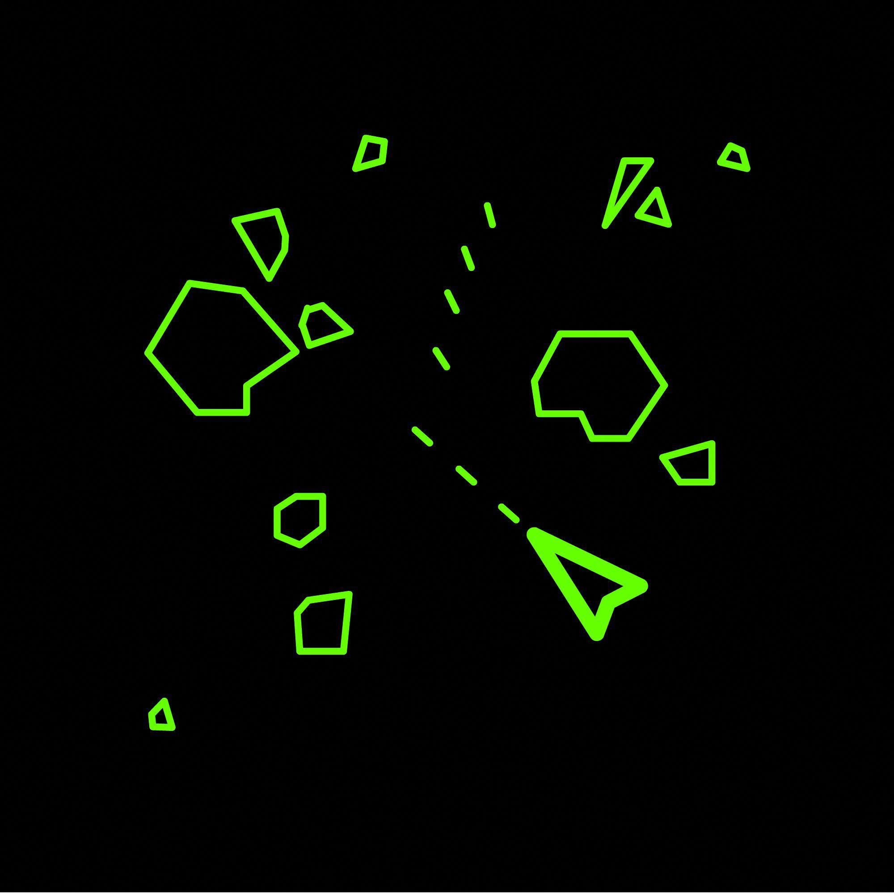
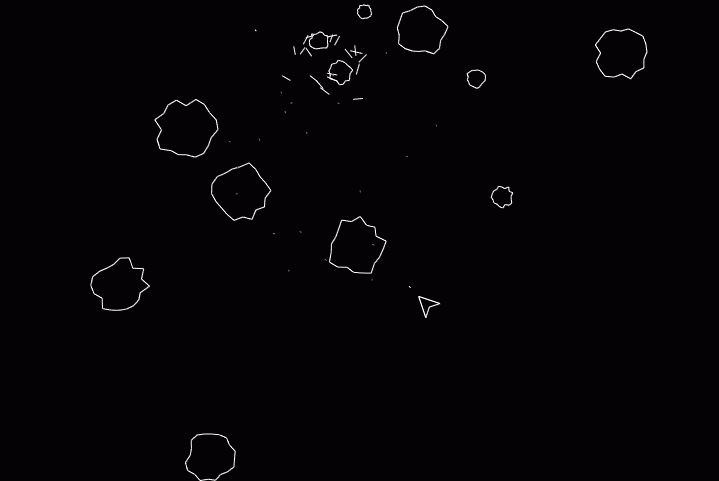
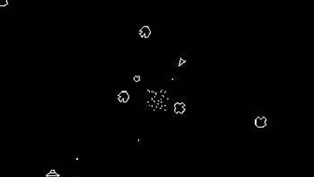

# Project X

## ЖАНР И СИНОПСИС

Project X - bullet hell, мультиплеерная сессионка с видом сверху, 
в которой сражения проходят на маленьких кораблях.

Давным-давным, в далекой-далекой галактике две
враждующие испокон веков космические фракции сталкиваются с сильнейшей
нехваткой ресурсов на своих планетах. В их солнечной системе не осталось ничего, времени и энергии на отправку в другие галактики нет, и единственная 
возможность одной фракции остаться в живых, это поработить другую.

---

## УПРАВЛЕНИЕ

### Геймпад

| Действие     | Кнопка      |
|:------------ |:----------- |
| Передвижение | Лв. Стик    |
| Поворот      | Пр. Стик    |
| Стрельба     | R2. Триггер |
|              |             |
|              |             |

### Клавиатура

| Действие     | Кнопка   |
|:------------ |:-------- |
| Передвижение | WASD     |
| Поворот      | Мышь     |
| Стрельба     | Лв. Мышь |
|              |          |
|              |          |

---

## ТЕЗАУРУС

`[ ДАННЫЕ УДАЛЕНЫ ]`

---

## СТИЛЬ ИГРЫ

<u>Игра должна ощущаться энергично и живо.</u>

  

Сражения проходят в открытом космосе на кораблях.  Цель каждого из игроков уничтожить кораблик другого.

Карта состоит из X*Y полей, игроки спавнятся на карте (точка спавна зависит от дизайна уровня), начинается игра.  

В каждый момент игры, игрок видит только ту часть поля, на которой находится его кораблик. Если кораблик подлетит слишком близко к границе, он либо попадает на новое поле, либо, если там граница карты, он в неё упирается.

---

## СИСТЕМЫ И МЕХАНИКИ

**Кораблик не может пролететь в одном направлении больше чем N раз**, он просто упрется в стенку как будто там граница карты.

Кораблик может летать в одну сторону и при этом быть повернут в другую, таким образом даже когда он отступает, он сможет отстреливаться.

Кораблик стреляет непрерывным потоком пуль.

Пуля всегда остается на локации и долетая до края карты просто вылетает из другого конца.

Кораблики могут столкнуться друг с другом, но в этом случае оба сразу проигрывают раунд.

---

## ПАРАМЕТРЫ

`[ ДАННЫЕ УДАЛЕНЫ ]`

---

## ДИЗАЙН

`[ ДАННЫЕ УДАЛЕНЫ ]`

---

## ПРОГРЕССИЯ

По мере игры пуль на карте будет становиться все больше и уклониться от них будет все сложнее, поэтому это заставит бывалого игрока обдумывать каждый выстрел.

---

## ИНТЕРФЕЙС

`[ ДАННЫЕ УДАЛЕНЫ ]`

---
